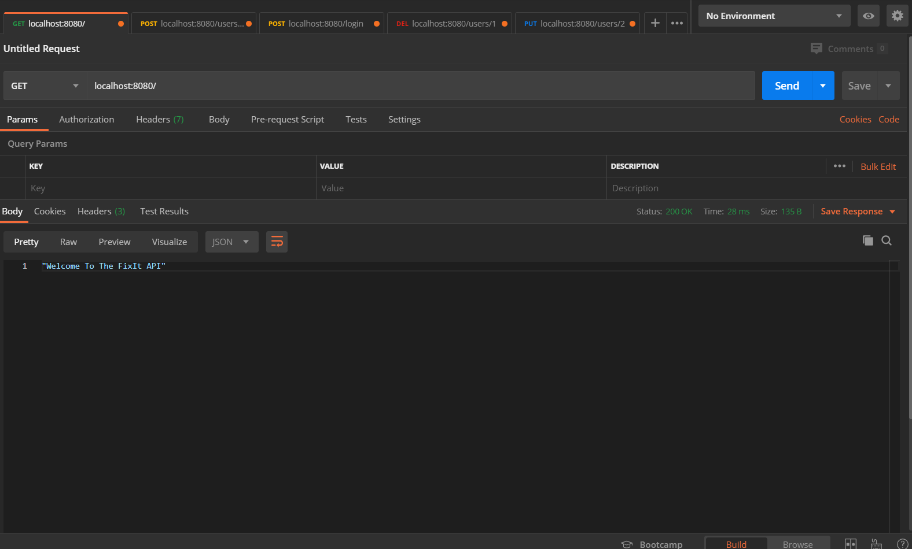
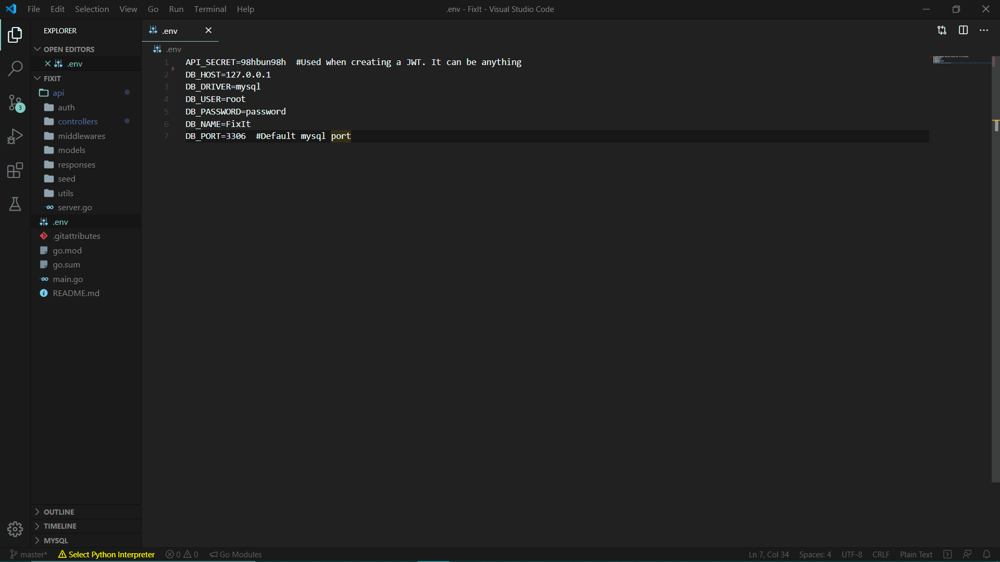
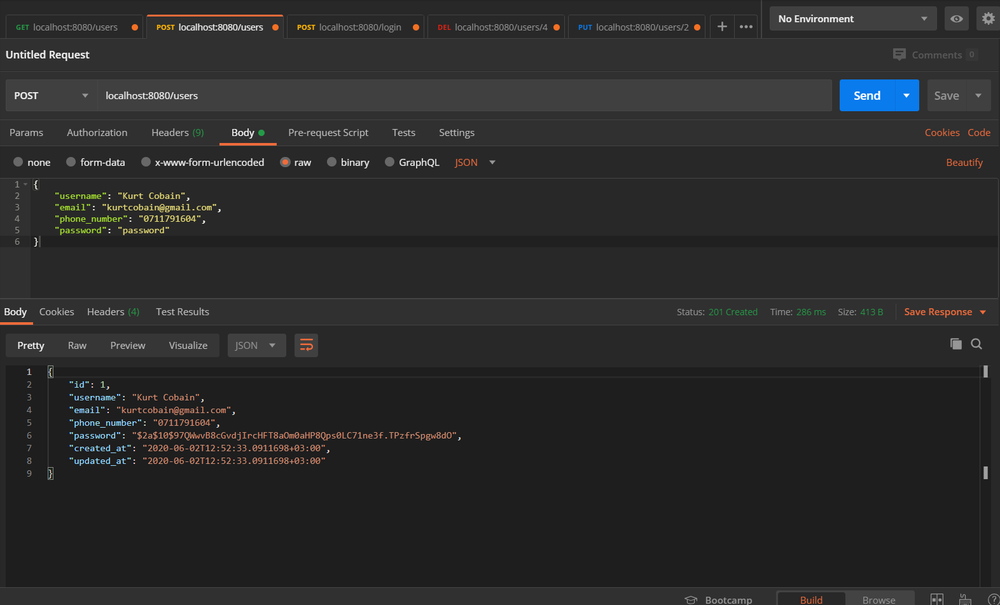
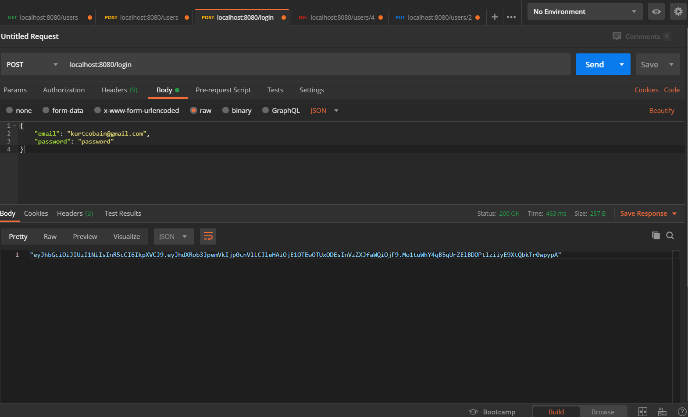
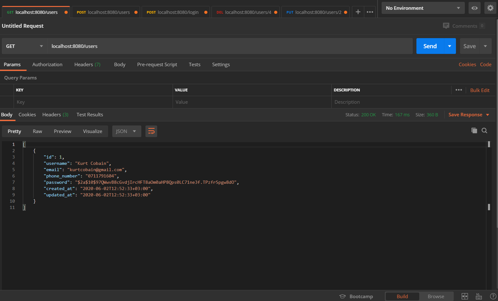
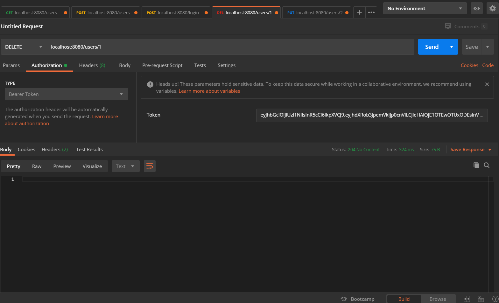

# FixIt Server
 Authentication API written in golang.

# Home Endpoint
This is the home endpoint of the api.

<p align="center">
    
</p>
<br>

# Enviroment variables
This is the home endpoint of the api. Change the variables according to your MySQL's username, password and database name.

*You have to create the database manually.
``` SQL
CREATE DATABASE database_name;
```

```
API_SECRET=98hbun98h  #Used when creating a JWT. It can be anything
DB_HOST=127.0.0.1
DB_DRIVER=mysql 
DB_USER= #change here
DB_PASSWORD= #change here
DB_NAME= #change here
DB_PORT=3306  #Default mysql port
```

<p align="center">
    
</p>


# Register User Endpoint
This is the endpoint to register users to the database.
```HTTP
localhost:8080/users
```

```JSON
{
    "username":"Victor Kabata",
    "email":"victorbro14@gmail.com",
    "phone_number":"0714091304",
    "password":"mementomori"
}
```

<p align="center">
    
</p>


# Login User Endpoint
This is the endpoint to login users.

```HTTP
localhost:8080/login
```

```JSON
{
    "email":"victorbro14@gmail.com",
    "password":"mementomori"
}
```

<p align="center">
    
</p>

# Get All User Endpoint
This is the endpoint to get all users in the daabase.

```HTTP
localhost:8080/users
```

<p align="center">
    
</p>

# Delete User Endpoint
This is the endpoint to delete a user from the daabase.

```HTTP
localhost:8080/users/{id}
```

* You also have to add the bearer's token for authorization.

<p align="center">
    
</p>

